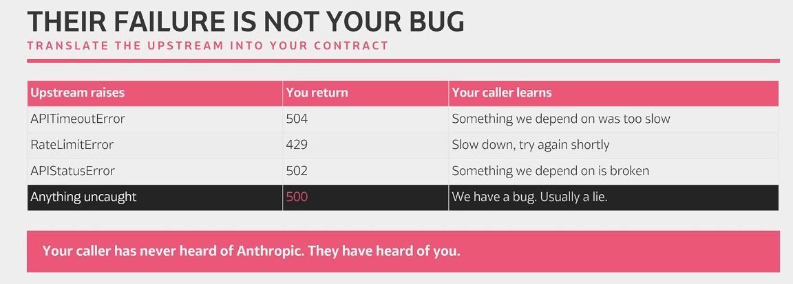

* The first call make robustly . Then streaming, structured output, and knowing what it cost before you spend it.
* Idempotency = Some methods by nature should have the same effect on the application state. For example PUT, POST, DELETE, and GET. Need to ensure this is followed. Using an idempotency key allows for previous requests to remembered.
* Timeout = If we have asynchronous processing in place, the request will wait before processing other request.

## Part One : The First Call

* Two retries you never asked for: Every one call is potentially three, with backoff silently
* A 10 minute read timeout: Wire that into an endpoint and one slow response holds a response for 600 seconds.
* Neither number is wrong. They are just not yours yet.
* Never return only the text: As our call returns back we need to see the

  * Content[0].text = The answer: a list because tool use and thinking live here too.
  * Usage input tokens = What you sent. This is the bill.
  * Usage output_tokens = What came back. Also the bill, at a higher rate.
  * Stop Reason = Whether you got a whole answer or it was vut off mid word. e.g. Max token limit
* A truncated answer returns 200 OK. Nothing in the text tells you there is a problem.
* 
* 

## Part Two:

*
